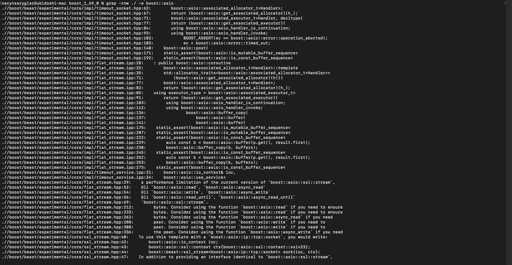
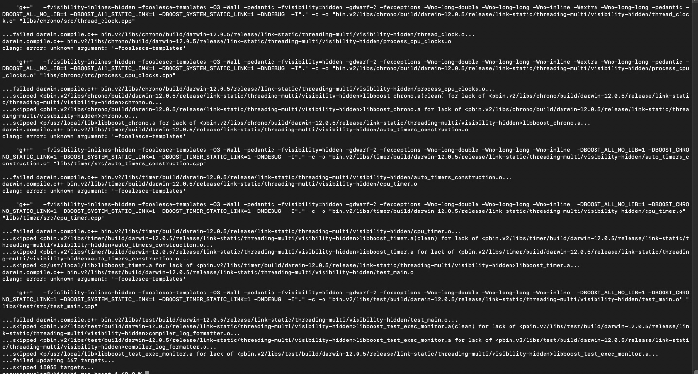
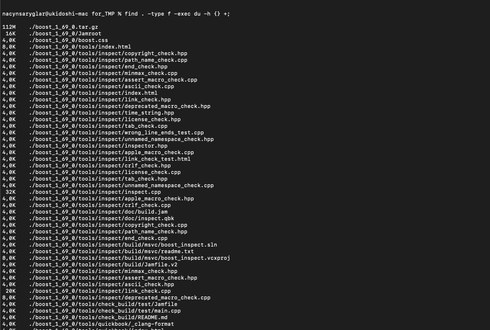

## Laboratory work I

Данная лабораторная работа посвещена изучению утилит для разработки проектов

## Tasks

- [ ] 1. Ознакомиться со ссылками учебного материала
- [ ] 2. Выполнить инструкцию учебного материала
- [ ] 3. Составить отчет и отправить ссылку личным сообщением в **Slack**

## Tutorial

```bash
$ export GITHUB_USERNAME=<имя_пользователя>
$ export GIST_TOKEN=<сохраненный_токен>
$ alias edit=<nano|vi|vim|subl>
```

```sh
$ mkdir -p ${GITHUB_USERNAME}/workspace
$ cd ${GITHUB_USERNAME}/workspace
$ pwd
$ cd ..
$ pwd
```

```sh
$ mkdir -p workspace/tasks/
$ mkdir -p workspace/projects/
$ mkdir -p workspace/reports/
$ cd workspace
```

```sh
# Debian
$ wget https://nodejs.org/dist/v6.11.5/node-v6.11.5-linux-x64.tar.xz
$ tar -xf node-v6.11.5-linux-x64.tar.xz
$ rm -rf node-v6.11.5-linux-x64.tar.xz
$ mv node-v6.11.5-linux-x64 node
```

```sh
$ ls node/bin
$ echo ${PATH}
$ export PATH=${PATH}:`pwd`/node/bin
$ echo ${PATH}
$ mkdir scripts
$ cat > scripts/activate<<EOF
export PATH=\${PATH}:`pwd`/node/bin
EOF
$ source scripts/activate
```

```sh
$ gem install gist
```

```sh
$ (umask 0077 && echo ${GIST_TOKEN} > ~/.gist)
```

## Report

```sh
$ export LAB_NUMBER=01
$ git clone https://github.com/tp-labs/lab${LAB_NUMBER} tasks/lab${LAB_NUMBER}
$ mkdir reports/lab${LAB_NUMBER}
$ cp tasks/lab${LAB_NUMBER}/README.md reports/lab${LAB_NUMBER}/REPORT.md
$ cd reports/lab${LAB_NUMBER}
$ edit REPORT.md
$ gist REPORT.md
```

## Links

### Unix commands

- [ar](https://en.wikipedia.org/wiki/Ar_(Unix))
- [cat](https://en.wikipedia.org/wiki/Cat_(Unix))
- [cd](https://en.wikipedia.org/wiki/Cd_(command))
- [cp](https://en.wikipedia.org/wiki/Cp_(Unix))
- [cut](https://en.wikipedia.org/wiki/Cut_(Unix))
- [echo](https://en.wikipedia.org/wiki/Echo_(command))
- [env](https://en.wikipedia.org/wiki/Env_(shell))
- [ex](https://en.wikipedia.org/wiki/Ex_(editor))
- [file](https://en.wikipedia.org/wiki/File_(command))
- [find](https://en.wikipedia.org/wiki/Find)
- [ls](https://en.wikipedia.org/wiki/Ls)
- [man](https://en.wikipedia.org/wiki/Man_page)
- [mkdir](https://en.wikipedia.org/wiki/Mkdir)
- [mv](https://en.wikipedia.org/wiki/Mv)
- [nm](https://en.wikipedia.org/wiki/Nm_(Unix))
- [ps](https://en.wikipedia.org/wiki/Ps_(Unix))
- [pwd](https://en.wikipedia.org/wiki/Pwd)
- [rm](https://en.wikipedia.org/wiki/Rm_(Unix))
- [sed](https://en.wikipedia.org/wiki/Sed)
- [touch](https://en.wikipedia.org/wiki/Touch_(Unix))

### Package Managers

- [apt](http://help.ubuntu.ru/wiki/apt) | [dnf](https://en.wikipedia.org/wiki/DNF_(software)) | [yum](https://fedoraproject.org/wiki/Yum/ru)
- [brew](https://brew.sh) | [linuxbrew](http://linuxbrew.sh)
- [npm](https://docs.npmjs.com)

### Software

- [curl](https://www.gitbook.com/book/bagder/everything-curl/details)
- [wget](https://www.gnu.org/software/wget/manual/wget.pdf)
- [clang](https://clang.llvm.org)
- [g++](https://gcc.gnu.org/onlinedocs/gcc-4.0.2/gcc/G_002b_002b-and-GCC.html)
- [make](https://en.wikipedia.org/wiki/Make_(software))
- [open](https://developer.apple.com/legacy/library/documentation/Darwin/Reference/ManPages/man1/open.1.html)
- [openssl](https://www.openssl.org)
- [nano](https://www.nano-editor.org)
- [tree](https://linux.die.net/man/1/tree)
- [vim](http://www.vim.org)

## Homework

1. Скачайте библиотеку *boost* с помощью утилиты **wget**. Адрес для скачивания `https://sourceforge.net/projects/boost/files/boost/1.69.0/boost_1_69_0.tar.gz`.
2. Разархивируйте скаченный файл в директорию `~/boost_1_69_0`
3. Подсчитайте количество файлов в директории `~/boost_1_69_0` **не включая** вложенные директории.
4. Подсчитайте количество файлов в директории `~/boost_1_69_0` **включая** вложенные директории.
5. Подсчитайте количество заголовочных файлов, файлов с расширением `.cpp`, сколько остальных файлов (не заголовочных и не `.cpp`).
6. Найдите полный пусть до файла `any.hpp` внутри библиотеки *boost*.
7. Выведите в консоль все файлы, где упоминается последовательность `boost::asio`.
8. Скомпилирутйе *boost*. Можно воспользоваться [инструкцией](https://www.boost.org/doc/libs/1_61_0/more/getting_started/unix-variants.html#or-build-custom-binaries) или [ссылкой](https://codeyarns.com/2017/01/24/how-to-build-boost-on-linux/).
9. Перенесите все скомпилированные на предыдущем шаге статические библиотеки в директорию `~/boost-libs`.
10. Подсчитайте сколько занимает дискового пространства каждый файл в этой директории.
11. Найдите *топ10* самых "тяжёлых".

```
Copyright (c) 2015-2021 The ISC Authors
```

## Мякин В.В. Лаба 1:

# Tutorial


# Пункт 1-2


# Пункт 3-4


# Пункт 5


# Пункт 6


# Пункт 7



# Пункт 8-9



# Пункт 10



# Пункт 11


